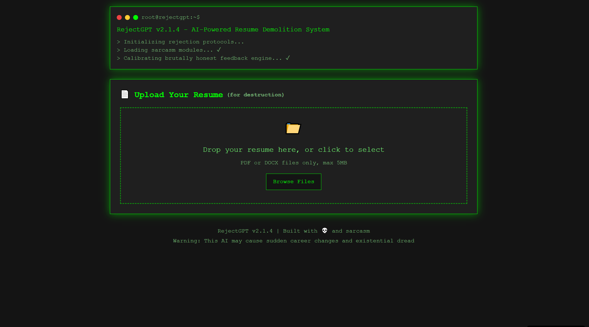

# RejectGPT using LangChain



A Flask-based backend service that analyzes resumes and generates brutally honest, humorous rejection letters with a corporate tone. Built with LangChain and HuggingFace models for intelligent AI-powered roasting.

## 🔥 Features

- **Resume Upload & Parsing**: Supports PDF and DOCX files up to 5MB
- **AI-Powered Roasting**: Uses LangChain + HuggingFace models for intelligent analysis
- **Link Validation**: Checks portfolio and social media links asynchronously with witty comments
- **Sentiment Analysis**: DistilBERT-powered tone analysis of resume content
- **Buzzword Detection**: AI identifies corporate jargon and overused phrases
- **Humorous Rejection Letters**: Generates contextually-aware, sarcastic corporate responses
- **Resume Scoring**: Provides numerical scores with detailed, brutally honest explanations
- **Job Description Comparison**: Compares resumes against job descriptions with roast-style feedback

## 🤖 LangChain Integration

RoastGPT leverages advanced AI models through LangChain:

### Models Used:
- **DistilBERT** (`distilbert-base-uncased-finetuned-sst-2-english`) - Sentiment analysis
- **DistilGPT2** - Creative rejection letter generation
- **TF-IDF Vectorizer** - Job description similarity matching

### AI-Powered Features:
- **Intelligent Buzzword Analysis**: Goes beyond keyword matching
- **Contextual Quality Assessment**: Understands resume content depth
- **Dynamic Rejection Letters**: Generates unique, contextually-appropriate responses
- **Sentiment-Aware Feedback**: Adjusts roasting intensity based on resume tone

## 🛠️ Tech Stack

- **Framework**: Flask 2.3.3
- **AI/ML**: LangChain, HuggingFace Transformers, scikit-learn
- **Resume Parsing**: pdfminer.six, python-docx
- **Async Processing**: aiohttp for concurrent link checking
- **Deployment**: Docker, Gunicorn
- **Models**: ~200MB total (downloaded on first run)

## 🚀 Quick Start

### Local Development

1. **Clone and setup**:
```bash
git clone <repository-url>
cd RejectGPT-Backend
```

2. **Install dependencies**:
```bash
pip install -r requirements.txt
```

3. **Run the application**:
```bash
python app.py
```

The server will start at `http://localhost:5000`

### Docker Deployment

1. **Build and run**:
```bash
docker build -t roastgpt-backend .
docker run -p 5000:5000 roastgpt-backend
```

## 📡 API Endpoints

### Health Check
```http
GET /health
```
Returns server status and LangChain model availability.

### Upload Resume
```http
POST /upload
```
Upload a PDF or DOCX resume file (max 5MB).

**Response**:
```json
{
  "status": "success",
  "resume_id": "uuid-string",
  "message": "Resume uploaded successfully! Prepare for some harsh truths."
}
```

### Analyze Resume (AI-Powered)
```http
GET /analyze/{resume_id}
```
Comprehensive AI analysis with LangChain-generated insights.

**Response**:
```json
{
  "status": "success",
  "rejection_letter": "AI-generated rejection letter",
  "sentiment_analysis": {
    "overall": "positive",
    "confidence": 0.85,
    "analysis": "Your resume radiates toxic positivity. Tone it down, champ."
  },
  "buzzwords_detected": [
    {
      "word": "synergy",
      "severity": "high", 
      "comment": "Synergy? Really? What is this, 2003?",
      "ai_analysis": "AI detected overuse of 'synergy'"
    }
  ],
  "score": {
    "value": 42,
    "grade": "F: Forget about it. Time for a career change.",
    "explanation": ["AI-powered scoring breakdown"]
  },
  "links": [
    {
      "url": "https://github.com/user",
      "status": 200,
      "comment": "Link works! Surprisingly functional, unlike your career.",
      "response_time": 450
    }
  ],
  "langchain_enabled": true
}
```

### Get Random Excuse
```http
GET /excuse
```
Returns a creatively crafted rejection excuse.

### Compare with Job Description
```http
POST /compare
```
AI-powered job description matching with roast commentary.

**Request**:
```json
{
  "resume_id": "uuid-string",
  "job_description": "Job requirements text..."
}
```

**Response**:
```json
{
  "similarity_score": 23.5,
  "missing_skills": ["python", "react", "common sense"],
  "mismatch": "Your resume has about as much relevance to this job as a chocolate teapot. You're missing key skills like python, react, common sense."
}
```

## 🧪 Testing

Run the test suite:
```bash
python -m pytest tests/ -v
```

Test coverage includes:
- Resume parsing functionality
- Link validation with async processing
- AI model integration
- LangChain chain execution

## 🔧 Configuration

### Environment Variables
```bash
export FLASK_ENV=production
export PORT=5000
export PYTHONPATH=/app
```

### Model Configuration
Models are automatically downloaded on first run:
- DistilBERT: ~66MB
- DistilGPT2: ~50MB
- Additional dependencies: ~84MB

## 📁 Project Structure

```
RejectGPT-Backend/
├── app.py                  # Flask application with LangChain integration
├── services/
│   ├── parser.py          # Resume parsing logic
│   ├── link_checker.py    # Async URL validation with wit
│   ├── analyzer.py        # LangChain + HuggingFace AI analysis
│   ├── excuses.json       # Curated rejection excuses
├── tests/
│   ├── test_parser.py     # Parser unit tests
│   ├── test_checker.py    # Link checker tests
│   ├── test_analyzer.py   # AI analysis tests
├── uploads/               # Resume upload directory
├── Dockerfile             # Container configuration
├── requirements.txt       # Python dependencies
└── README.md             # This file
```

## 🎯 AI Analysis Examples

### Buzzword Detection
```
Input: "I'm a passionate, results-driven team player"
AI Output: "Buzzword bingo champion detected. 'Passionate' and 'results-driven' are corporate speak for 'I have no real skills.'"
```

### Sentiment Analysis
```
Resume Tone: Overly positive
AI Analysis: "Your resume radiates toxic positivity. Tone it down, champ."
```

### Quality Assessment
```
AI Score: 3/10
Analysis: "Your descriptions are vaguer than your career prospects. 'Worked on stuff' is not a skill."
```

## 🚨 Deployment Notes

### Free Platform Deployment
- **Render**: Automatic builds from Git
- **Railway**: One-click deployment
- **Heroku**: Classic PaaS option

### Resource Requirements
- **Memory**: 1GB minimum (for model loading)
- **Storage**: 500MB (models + dependencies)
- **CPU**: 1 vCPU sufficient for moderate load

## 🤝 Contributing

1. Fork the repository
2. Create a feature branch
3. Add tests for new functionality
4. Ensure LangChain integration works properly
5. Submit a pull request

## 📝 License

MIT License - Feel free to roast resumes responsibly!

## ⚠️ Disclaimer

RoastGPT is designed for entertainment and educational purposes. The AI-generated content is intentionally humorous and should not be taken as professional career advice. Use responsibly and remember that behind every resume is a human being trying their best.

---

**Powered by LangChain 🦜🔗 | HuggingFace 🤗 | Flask**